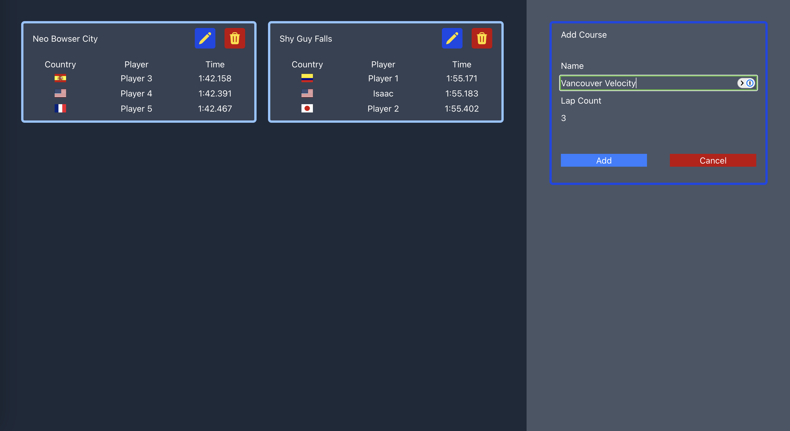

My Intro to Vue
======

### Introduction
This is a repo used to display my progress on learning web dev.



These are the top three times on two tracks in Mario Kart 8 Deluxe (full leaderboards can be found at [MKLeaderboards](https://www.mkleaderboards.com/mk8dx)), you click on a row and their splits for each lap will show for the track the player is listed under.

#### Strong practice with core language
This was completed using:

* Vue
* JavaScript
* HTML

My HTML repo includes a simple CSS style unlike this Vue repo at the moment, but this commit is intended to show my progress specifically on learning how to use VueJS.

If you wish to run and test this, just download the repo, cd into basic_vue, run `npm install` and `npm run dev`, and go to your localhost:xxxx

###### Vue Example

```html
<tr @click="onPlayerClicked(player)" v-for="player in course.players">
    <td></td>
    <td>{{ player.name }}</td>
    <td>{{ player.finalTime }}</td>
</tr>
```