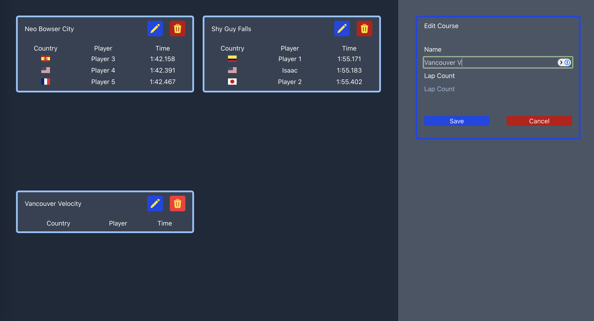

My Intro to Vue
======

### Introduction
This is a repo used to display my progress on learning web dev.


These are the top three times on two tracks in Mario Kart 8 Deluxe (full leaderboards can be found at [MKLeaderboards](https://www.mkleaderboards.com/mk8dx)), you click on a row and their splits for each lap will show for the track the player is listed under.

#### Strong practice with core language
This was completed using:

* Vue
* Tailwind CSS
* JavaScript
* HTML

Since my last ReadMe update, I've come around to:

* Vue
* Flexbox & Grid
* Neater Styling
* Support for Horizontally Crammed Windows (Sort Of)
* Fixing my terrible habit of not putting a table head or body.



If you wish to run and test this, just download the repo, cd into basic_vue, run `npm install` and `npm run dev`, and go to your localhost:xxxx

###### Vue/Tailwind - Player Details

```html
<div class=" border-blue-300 bg-lime-200 px-4 py-2 rounded-md border-4">
    <p>Run Details</p>
    <table>
        <thead>
            <tr>
                <th>
                </th>
                <th>{{ player.name }}</th>
                <th>{{ player.finalTime }}</th>
            </tr>
        </thead>
        <tbody>
            <tr v-for="lap in player.lapTimes">
                <td colspan="2" align="center">Lap {{ lap.order }}</td>
                <td colspan="1">{{ lap.time }}</td>
            </tr>
        </tbody>
    </table>
</div>
```